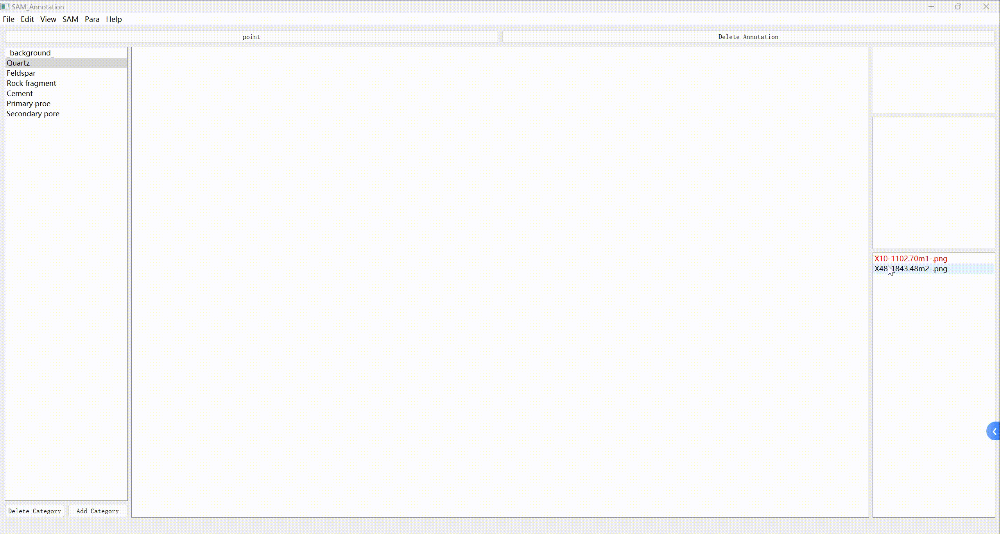

# SAM_Annotation

# Dense Sandstone Image Annotation with SegmenAnything (SAM)

Welcome to our repository that focuses on efficient and precise annotation and segmentation of dense sandstone images. This codebase is dedicated to the data annotation tool designed using PyQt5. For the UNet image segmentation part and the fine-tuning of the SAM model, please refer to our other repositories.

[FineTuneSAM-with-Bounding-Box](https://github.com/wudi-ldd/FineTuneSAM-with-Bounding-Box).

[FineTuneSAM-with-Bounding-Box](https://github.com/wudi-ldd/FineTuneSAM-with-Bounding-Box).

## Key Features

- **Point Annotation**: Utilize minimal points to define complex structures in dense sandstone images.
- **Data Masking**: Accurately generate masks that are crucial for further analysis or machine learning applications.
- **Efficiency**: Expedite the annotation process without compromising on precision.
- **Customizable**: Flexible tool design to suit various annotation needs.

## Visualization of SAM Model Fine-Tuning

1. **Before Fine-Tuning**:  
     

2. **After Fine-Tuning**:  
     

## Model Usage Instructions

**Step 1**: Download the pre-trained weights of the SAM model and place them in the `checkpoints` folder. [Download Link](https://github.com/facebookresearch/segment-anything)

**Step 2**: Modify the following lines in `utils\file_functions.py` according to the chosen weight type:

For detailed instructions, refer to the [SAM Official Website](link_to_sam_official_website).

**Step 3**: For fine-tuning the SAM model, you can refer to my other article: [Link to Article](link_to_article)

## Shortcuts

- **Left Mouse Click**: Click on areas of interest.
- **Right Mouse Click**: Click on areas not of interest to complete the data annotation without manually drawing mask boxes.
- **Z**: Undo to the previous mouse click state.
- **E**: Finish annotation and save the current mask state.

## Installation

[Provide installation instructions here]

## Contributing

We welcome contributions to this project. If you have suggestions, bug reports, or want to contribute, please feel free to open an issue or submit a pull request.

## License

This project is licensed under the [MIT License](LICENSE).
\end{verbatim}

